  

I work on two sides of software. On the research side I study machine learning, mostly federated learning and how to keep models from being fooled. On the building side I make full-stack apps with the MERN stack, and lately I've been adding LLMs and RAG to them.

## Research

**Federated learning.** Training models across many devices without collecting everyone's data in one place.

**ML security.** Finding out how models break under attack, and how to make them harder to break.

**Learning right now:** LLMs, retrieval-augmented generation, and image generation.

## Building

| Project | What it is |
| --- | --- |
| [Shadow Path](https://shadow-path-ninja.vercel.app/) | A ninja game you can play in the browser |
| More on my [portfolio](https://portfolio-eight-tawny-74.vercel.app/) | Full-stack projects, with more being added |

## Tools

**For research** 

**For the web** 

**For everything else** 

## Get in touch

Ask me about machine learning or Python. You can reach me by [email](mailto:www.nino39@gmail.com) or on [LinkedIn](https://www.linkedin.com/in/nino-chakma-a4a638302).
